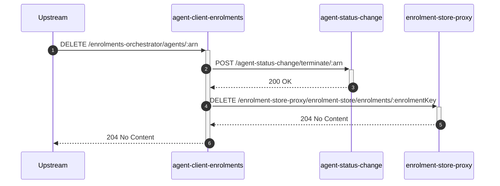
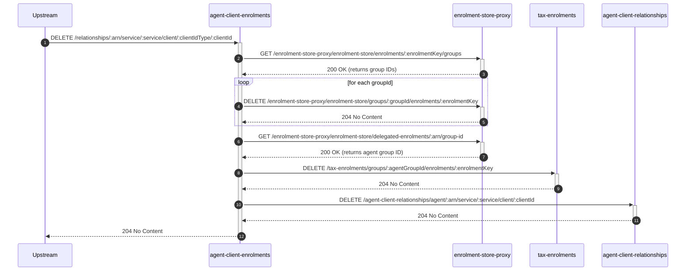

# agent-client-enrolments

## AgentController

## `DELETE /enrolments-orchestrator/agents/:arn`

**Description:** De-enrol an agent and terminate their active sessions based on their Agent Reference Number (ARN).

### Sequence of Interactions

1. **API Call:** `POST /agent-status-change/terminate/:arn` to `agent-status-change` to request the termination of the agent's status.
2. **API Call:** `DELETE /enrolment-store-proxy/enrolment-store/enrolments/:enrolmentKey` to `enrolment-store-proxy` to delete the agent's enrolment.

### Sequence Diagram

---

## `DELETE /relationships/:arn/service/:service/client/:clientIdType/:clientId`

**Description:** De-allocates an agent's client's enrolment from the agent's group, and deletes the relationship.

### Sequence of Interactions

1. **API Call:** `GET /enrolment-store-proxy/enrolment-store/enrolments/:enrolmentKey/groups` to `enrolment-store-proxy` to get principal group IDs for the client's enrolment.
2. **API Call:** `DELETE /enrolment-store-proxy/enrolment-store/groups/:groupId/enrolments/:enrolmentKey` to `enrolment-store-proxy` to delete the client's enrolment from their group (for each group ID found).
3. **API Call:** `GET /enrolment-store-proxy/enrolment-store/delegated-enrolments/:arn/group-id` to `enrolment-store-proxy` to get the group ID for the agent's ARN.
4. **API Call:** `DELETE /tax-enrolments/groups/:agentGroupId/enrolments/:enrolmentKey` to `tax-enrolments` to de-allocate the client's enrolment from the agent's group.
5. **API Call:** `DELETE /agent-client-relationships/agent/:arn/service/:service/client/:clientId` to `agent-client-relationships` to delete the agent-client relationship.

### Sequence Diagram

